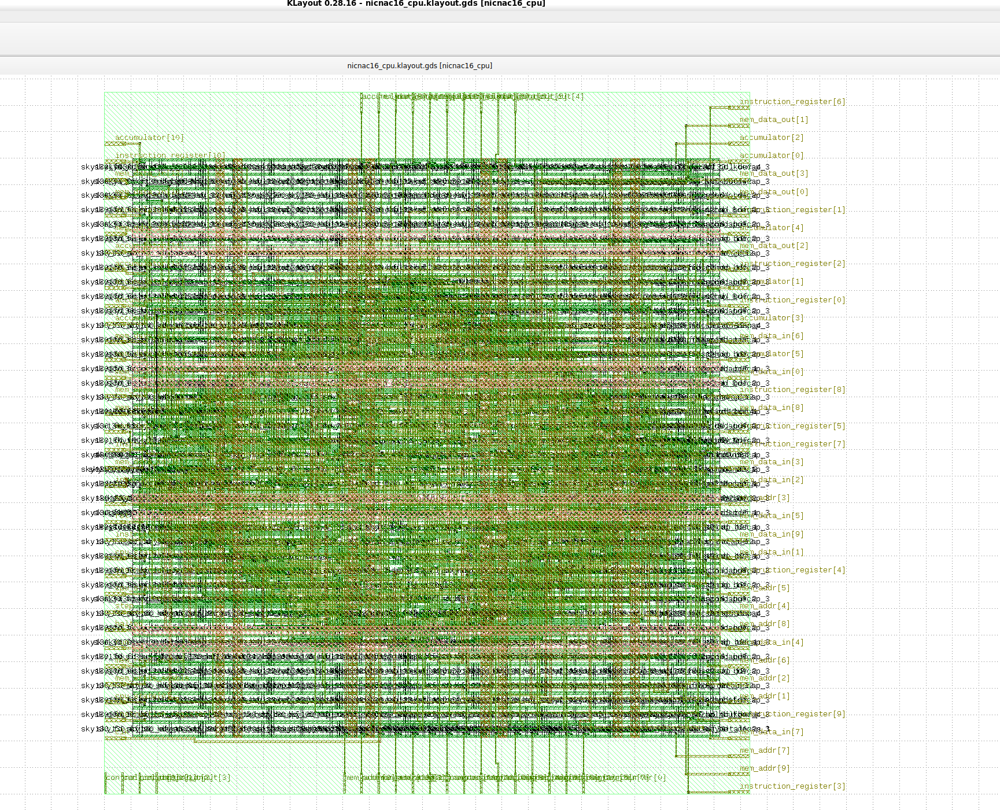

NICNAC16
========
[](https://github.com/nczempin/NICNAC16-FPGA/actions/workflows/ci.yml)

Learning FPGAs, starting with a 16-bit CPU design

See [instruction_set.md](docs/instruction_set.md) for details on the instruction set.




## Setup

Install the required build tools (g++, make, cppcheck and iverilog) using the provided script.
The script checks whether each tool is present and installs any missing packages
before verifying that the installation succeeded:


```sh
./setup.sh
```


## Build and Test

Run the default Makefile target to lint the HDL sources, execute the Memory testbench and create build artifacts:

```sh
make
```

## What Currently Works

- `NOP`, `LDA`, `ADD` and `JMP` instructions run successfully in simulation.
- The memory subsystem passes the provided testbench.
- Build artifacts can be generated via `make`.

## What's Next

- Implement the remaining instruction set and CPU pipeline.
- Improve hardware integration for a development board.
- Expand automated tests and linting coverage.

## Project Status

### Implemented and Tested

- Setup script installs and verifies toolchain packages.
- Memory testbench executes without errors.

### In Progress

- Additional instructions and CPU modules.
- More comprehensive simulation and hardware validation.

### Planned

- Full system bring-up on FPGA hardware.

## Scope and Limitations

This project is a learning exercise and is **not** intended for production use.
It targets a simple 16‑bit CPU design to demonstrate basic FPGA workflows.
It is not built for high‑performance or safety‑critical applications, nor is
it meant to scale to complex systems.
