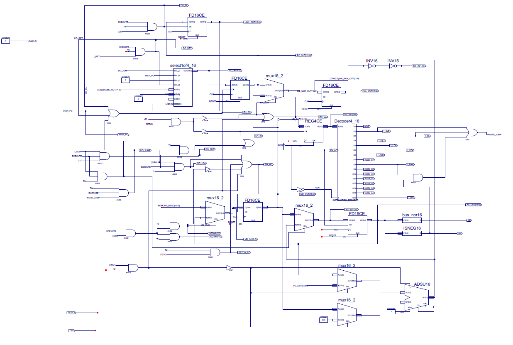

NICNAC16
========

Learning FPGAs, starting with a 16-bit CPU design

## Project Structure

- `docs/`: Contains documentation, schematics, and design files.
- `pictures/`: Contains simulation screenshots and other images.
- `vivado_proj/`: Contains the Vivado FPGA project files. Source files for the CPU design are located within the `vivado_proj/Basys-3-GPIO.srcs/` subdirectory.
